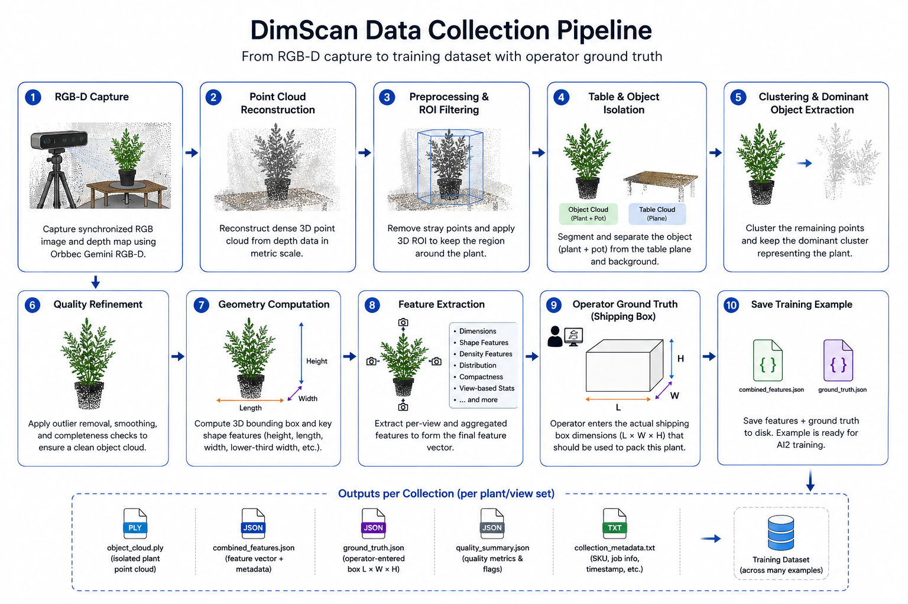
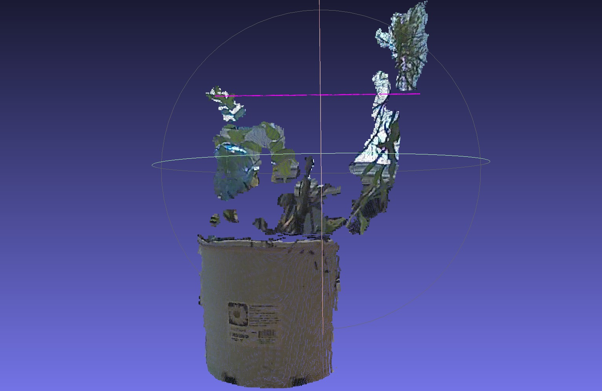
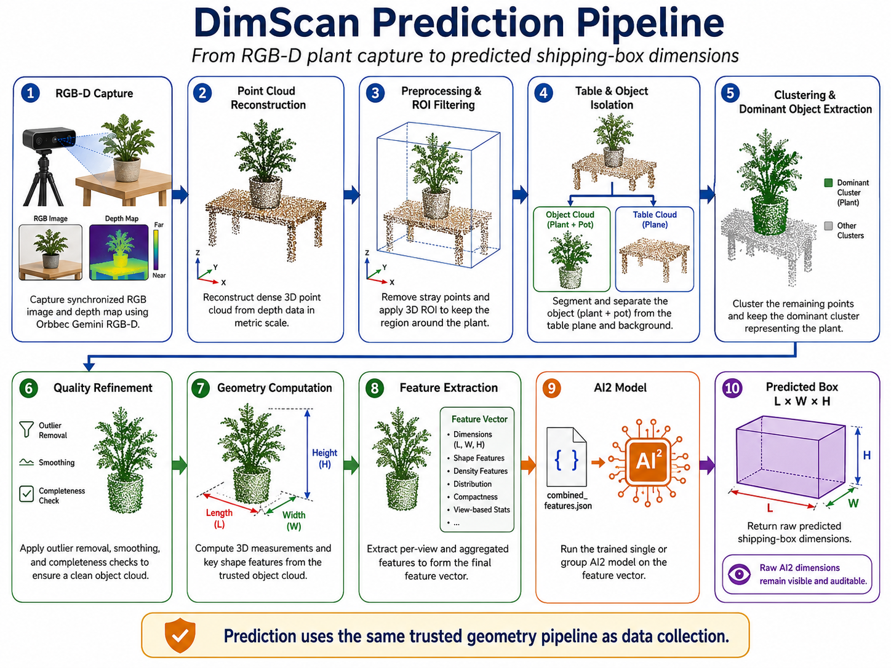
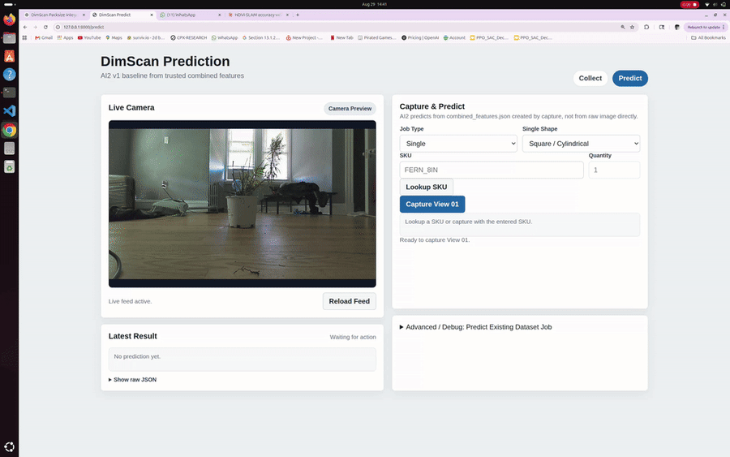

# DimScan: RGB-D Dimensioning and Learned Packing for Irregular Objects

**Personal Project · May 2023 – Jul 2026**  
**Stack:** Python · Open3D · PyTorch · scikit-learn · Flask · Orbbec Gemini RGB-D · Ultralytics YOLOE

---

## What This Is

Traditional dimension scanners work well for rigid objects because their outer dimensions are stable and easy to describe with a simple bounding box. Nursery plants are different: they are sparse, irregular, asymmetric, and deformable, so the box required to pack them safely is not always obvious from a single rigid measurement.

**DimScan** is an end-to-end RGB-D perception and machine-learning system built to measure irregular objects in 3D and predict the shipping-box length, width, and height required to pack them.

The system reconstructs the object from RGB-D data, isolates a trusted 3D point cloud, and extracts geometric and shape features. During data collection, an operator enters the actual box dimensions that should be used for that plant. Those examples become the training set for **AI2**, a second-stage regression model that learns the relationship between object geometry and final packing dimensions.

The same design can be retrained for other irregular or deformable objects by collecting new geometry and task-specific ground-truth packing data rather than hard-coding one dimensional rule.

---

## Why This Problem Is Different

A rigid box, carton, or machined part can usually be described directly by its maximum length, width, and height.

A plant cannot.

Leaves extend in different directions, branches create sparse protrusions, the canopy can be asymmetric, and two plants with similar maximum dimensions can occupy space very differently.

DimScan therefore separates the problem into two stages:

```text
Stage 1: Measure the real 3D geometry reliably
Stage 2: Learn how that geometry maps to a practical shipping box
```

The first stage is deterministic geometry. The second stage is learned from operator-provided examples.

---

## Data Collection Pipeline



The collection pipeline converts a synchronized RGB-D observation into a trusted 3D representation, extracts a compact feature vector, and pairs that representation with operator-entered shipping-box ground truth.

The most important design rule is that **geometry remains authoritative**. AI segmentation can provide optional support information, but it does not decide which 3D points belong to the measured object.

---

## From RGB-D Frame to Trusted Object Geometry


The geometry pipeline is the core of DimScan.

The main stages are:

- **Calibrated 3D ROI filtering** to keep only the physical work volume.
- **Table and object isolation** to separate the plant from the support surface and background.
- **Voxelization** to reduce point density while preserving object structure.
- **Clustering** to separate the plant from disconnected geometry.
- **Dominant-object selection** to identify the primary plant.
- **Nearby-fragment recovery** to recover valid geometry that may separate during clustering.
- **Trusted object-cloud generation** as `object_cloud.ply`, which becomes the source for downstream measurements and features.

This geometry-first design is deliberate: an incorrect AI mask should not be able to silently redefine the object being measured.

---

## Geometric Measurements



From the isolated cloud, DimScan computes physical measurements directly in metric 3D space.

Representative measurements include:

- object length
- object width
- object height
- lower-third width
- center-of-mass information
- point-cloud density
- compactness
- shape-profile measurements

The goal is not only to capture the maximum bounding dimensions, but also to describe **how the plant occupies space**.

That distinction matters for packing: two plants may have similar maximum width while having very different shape profiles or spatial density.

---

## Feature Representation

AI2 receives a compact feature vector derived from the trusted object geometry rather than raw images.

Representative inputs include:

- **length, width, height**
- **lower-section width**
- **point-cloud density**
- **compactness**
- **center-of-mass / spatial distribution**
- **shape-profile information**
- **pot and SKU information**

For rectangular or strongly asymmetric plants, DimScan supports **two-view capture**. The operator captures one view, rotates or rearranges the plant, and captures another so that one camera perspective does not hide important geometry.

The resulting per-view information is combined into one prediction-ready representation.

---

## Data Collection Workflow

### Single-Plant Mode


A single collection job follows this sequence:

```text
Select plant / SKU
→ Capture RGB-D data
→ Build trusted object cloud
→ Extract geometry features
→ Review measurements
→ Enter true shipping-box L × W × H
→ Save training job
```

Ground truth is always entered by the operator. It remains separate from model output and is never overwritten by prediction.

### Second Single-Plant Example


The same capture and feature-generation path is reused across visibly different plant geometries rather than being tuned around one specific shape.

### Group / Multiple-Plant Mode


DimScan also supports grouped arrangements.

Group jobs use the same geometry-first capture process while storing the arrangement and composition information needed for a separate group-packing model.

The group data-collection path is implemented and is currently being used to build the dataset required to evaluate the group prediction model independently.

---

## Prediction Pipeline



Prediction uses the same trusted geometry path as data collection.

Instead of asking the operator for a ground-truth box, the generated feature vector is passed directly to the trained AI2 model, which predicts box **length, width, and height**.

Single and group jobs use separate model paths because they represent different packing problems.

---

## AI2: Learned Shipping-Box Prediction

AI2 learns from geometry-derived features together with operator-entered ground-truth box dimensions.

```text
Trusted 3D geometry
+ shape information
+ SKU / pot information
        ↓
      AI2
        ↓
Predicted box length
Predicted box width
Predicted box height
```

The raw AI2 output remains visible and auditable. Ground truth stays unchanged so that future retraining always uses the original operator label rather than a previous prediction.

---

## Prediction Demo



In Predict mode, DimScan runs the same RGB-D geometry pipeline used during data collection, generates the feature vector, and passes it directly to the trained AI2 model.

The current single-plant model was trained on **50 collected examples**. The model predicts the required shipping-box **length, width, and height**, while the original ground-truth dimensions remain unchanged for comparison and future retraining.

The prediction demo above shows the full end-to-end path from plant capture to AI2 output.

### Current Validation Snapshot

| Result | Current value |
|---|---|
| Single-plant training data | **50 collected examples** |
| Same-plant geometry variation | **0.07–0.09 in** |
| Collection-ready latency | **3.4–3.9 s** |
| Original capture latency | **20–25 s per view** |
| Single-plant prediction | **Implemented and demonstrated** |
| Group-mode collection | **Implemented; dataset still growing** |
| Group prediction evaluation | **Pending a sufficiently diverse group dataset** |

These results are an early validation of the complete perception-to-prediction pipeline rather than a claim of final production accuracy. The main remaining bottleneck is dataset diversity, not geometry repeatability.

---

## Measurement Repeatability

Repeated captures of the same plant produced approximately:

**0.07–0.09 in of measurement variation**

This was an important milestone because the learning stage is only useful if the perception pipeline gives stable inputs.

The perception system was therefore treated as a measurement problem first and an ML problem second.

---

## Performance

The original pipeline required roughly:

**20–25 s per view**

After profiling and optimization, a typical capture became ready for collection in approximately:

**3.4–3.9 s**

The speedup came from removing unnecessary work rather than weakening the trusted geometry path:

- cached repeated model/setup work
- removed duplicate processing
- avoided unnecessary dense debug artifacts
- skipped optional object-cloud writes when disabled
- optimized image/file output
- reused cached table-plane information

The voxelization, clustering, dominant-object selection, and geometry extraction stages were intentionally preserved because they were already producing stable measurements.

---

## Key Engineering Decisions

### Geometry remains authoritative

AI1/YOLOE is support/debug only. It may provide optional semantic information when valid, but it cannot determine `object_cloud`.

If AI1 fails, geometry extraction still succeeds.

### Ground truth is protected

Operator-entered box dimensions remain the source of truth for training.

Prediction never overwrites ground truth.

### Single and group prediction are separate problems

Single-plant and grouped-plant data are stored and trained separately so that one workflow does not silently change the behavior of the other.

### The core pipeline stays synchronous

A capture request performs the required processing before returning its result. DimScan does not rely on background workers, deferred artifacts, or hidden internal queues for collection or prediction.

---

## Known Limits

**The dataset is still growing.** The geometry pipeline is already repeatable, but AI2 generalization is limited mainly by the number and diversity of unique physical plants available for training.

**Repeated captures do not replace physical diversity.** Multiple captures of one plant are useful for testing repeatability, but new plant shapes, sizes, SKUs, pots, and arrangements are what improve model generalization.

**Group prediction needs its own evaluation dataset.** The group collection workflow is implemented, but the group model should not be judged from the single-plant dataset.

**AI1 semantic features remain optional.** Generic leaf segmentation is not trusted enough to become part of the authoritative geometry pipeline. Unreliable semantic features are left unused rather than injecting noise into AI2.

---

## What I Learned

**Stable perception matters more than adding more ML.** A larger model cannot compensate for unstable physical measurements.

**More features are not automatically better.** A noisy feature can reduce generalization. Stable 3D geometry is more valuable than unreliable semantic detail.

**Dataset diversity is now the main bottleneck.** Once same-plant variation dropped below a tenth of an inch, the limiting factor moved from measurement quality to the number of genuinely different plants available for training.

**Perception and prediction must be evaluated separately.** A geometry pipeline can be highly repeatable while the learned model still needs more examples. Keeping the stages separate makes failures easier to diagnose.

---

## Future Work

- **Expand the single-plant dataset with more unique physical plants**, covering wider variation in species, canopy shape, overall size, pot size, and same-SKU growth variation.
- **Continue collecting group-mode data** and evaluate the separate group model once the dataset contains enough diverse arrangements.
- **Retrain AI2 on larger plant-grouped splits** so that test plants are physically different from training plants.
- **Refine prediction accuracy toward a consistent ±1 in target** for box length, width, and height.
- **Run feature-ablation studies** to identify which geometry, shape, SKU, and pot features actually improve unseen-plant prediction.
- **Build a harder validation set** containing sparse foliage, wide canopies, unusual asymmetric plants, and visually similar plants with different physical sizes.
- **Continue performance optimization only where profiling identifies a real bottleneck**, without trading away geometry accuracy or repeatability.
