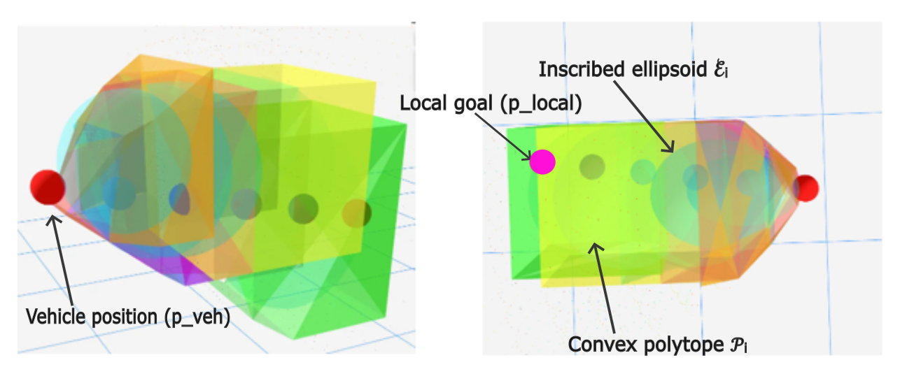
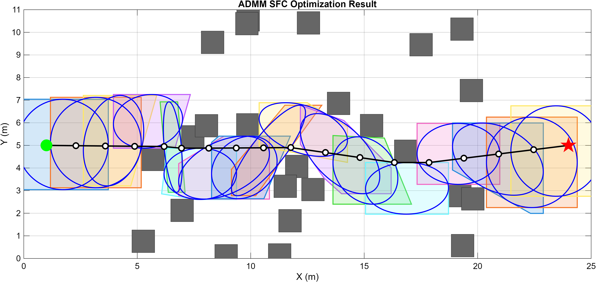
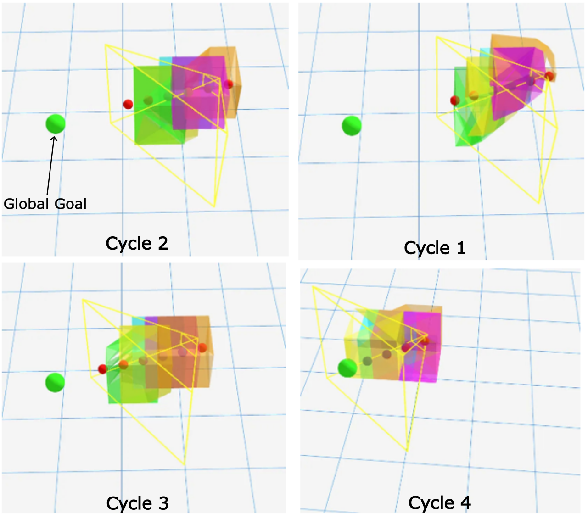

# Perception-Constrained Safe Flight Corridor Planning for Autonomous Quadrotor Navigation

**MS Thesis Project · SiliconSynapse Lab, Northeastern University · Nov 2025 – Apr 2026**  
**Stack:** C++17 · ROS2 Humble · OctoMap · IRIS · CasADi/MOSEK · Docker · VOXL2 ARM64 · PX4 · OptiTrack

---



---

## What This Is

A full 3D motion planning system for a real quadrotor, deployed onboard and validated in hardware-in-the-loop conditions. The system generates a **Safe Flight Corridor (SFC)** — a chain of overlapping, collision-free convex polytopes — that a trajectory optimizer can use to compute smooth, provably safe trajectories.

The core problem: free space in a cluttered environment is non-convex, making trajectory optimization hard. SFCs convert that non-convex collision avoidance problem into a set of linear inequality constraints, enabling efficient convex trajectory optimization downstream.

This project focuses specifically on SFC *generation* under **perception constraints** — planning only within what the sensor can currently observe, never through unverified space.

---

## System Architecture

The pipeline runs entirely onboard the **VOXL2 ARM64** flight computer inside a Docker container. No computation is offloaded to the ground station.

```
OptiTrack (120 Hz pose)
        │
   mocap_bridge         ← NED→ENU frame conversion, safety filtering
        │
   frustum_node         ← Raycast OctoMap, classify free/occupied voxels
        │                  within sensor frustum (HFOV=80°, VFOV=70°, 0.3–2.0m)
   sfc_ros_node
        │
   ┌────┴─────────────────────────────┐
   │  A* → IRIS → ADMM → Validation  │
   └────┬─────────────────────────────┘
        │
   /sfc_planner/corridor  (published to Foxglove / downstream consumers)
```

**ROS2 nodes:** `mocap_bridge`, `frustum_node`, `sfc_ros_node`, `octomap_publisher`  
**Third-party deps:** OctoMap, IRIS (built from source for ARM64), CasADi, MOSEK 10.1, Eigen3

---

## The Planning Pipeline

Replanning is triggered every time the vehicle moves **0.3 m** from its last planning position. At each trigger, five chained algorithms execute in sequence:

### Algorithm 1 — Frustum Setup
Computes which voxels in the global OctoMap are currently observable by the depth sensor. Models the sensor as a 6-halfplane truncated pyramid (4 walls + near/far bounds). Outputs:
- **F_free** — free voxels inside the frustum
- **O_local** — obstacle voxels inside the frustum  
- **p_local** — furthest visible free point toward the global goal
- **H_frust** — 6 halfplane constraints bounding the observable volume

Voxels outside the frustum are treated as occupied. The planner never routes through unobserved space.

### Algorithm 2 — A* Path Planning
Runs A* over F_free (26-connectivity voxel grid, Euclidean heuristic). Post-processes the result: collinear pruning, intermediate waypoint insertion on long segments, minimum spacing enforcement. Produces a well-conditioned seed sequence {p_1, ..., p_M} for IRIS.

### Algorithm 3 — IRIS Polytope Inflation
For each waypoint p_i, inflates a collision-free convex polytope by alternating between:
1. **Ellipsoid expansion** — find the maximum-volume ellipsoid inscribed in the current halfspace system (SDP via MOSEK)
2. **Halfspace construction** — add separating hyperplanes tangent to the ellipsoid at the nearest obstacle points

H_frust constraints are loaded *first*, clipping each polytope to the observable sensor volume before any obstacle-driven halfplanes are added.

### Algorithm 4 — ADMM Corridor Refinement
Jointly optimizes waypoint positions and ellipsoid shapes to maximize corridor volume and overlap quality. Alternates between:
- **Waypoint update** — minimize path length subject to waypoints lying in polytope intersections
- **Ellipsoid update** — re-inflate polytopes at updated waypoint positions (IRIS, N_inner=3 iterations)
- **Dual variable update** — enforce coupling constraints between waypoints and ellipsoids

Parameters: N_outer=2, N_inner=3, ρ=1.0, ε=0.1, bbox=0.45m

### Algorithm 5 — Validation & Publish
Checks every polytope in the final corridor against all known obstacle points. Any corridor containing an obstacle is discarded and replanning is triggered. Only certified obstacle-free corridors are published.

---

## Hardware Deployment

| Component | Details |
|---|---|
| Flight computer | ModalAI VOXL2 (ARM64, Ubuntu 22.04) |
| Flight stack | PX4 |
| State estimation | OptiTrack mocap (120 Hz, NED→ENU conversion) |
| Environment map | Pre-built static OctoMap (.bt), 5×5×5m indoor cage |
| Container | Docker (ROS2 Humble + IRIS + MOSEK ARM64 + CasADi) |
| Visualization | Foxglove Studio over WebSocket |

The biggest embedded systems challenge was cross-architecture dependency resolution: IRIS required source-level ARM64 build fixes, MOSEK needed the ARM64-specific binary and license path, and CasADi required explicit symlinks for the C++ linker. All packaged into a single Docker container for reproducible deployment.

---

## Key Engineering Decisions

**NED→ENU coordinate frame fix**  
The OptiTrack system outputs in NED (PX4 convention), but OctoMap and the planner use ENU. A silent mismatch between these frames caused the planner to mislocalize the vehicle in the map, producing corridors that were geometrically valid but physically wrong. Found by instrumenting every transform in the pipeline and cross-validating against mocap ground truth.

**Frustum-constrained IRIS initialization**  
H_frust halfplanes are loaded into IRIS *before* obstacle halfplanes. This clips each polytope to the observable volume from the start, rather than inflating freely and clipping afterward. Without this, IRIS could produce polytopes that extend into unobserved space even though the final corridor passes validation.

**A* start at near-frustum boundary**  
Placing A*'s start at r_min=0.3m forward (not at the vehicle position) avoids the sensor blind zone and ensures the entire planned path lies within observable free space.

**Free-space bubble at start position**  
A small free-space bubble is explicitly cleared around the local A* start position to guarantee A* can initialize from a traversable cell even when the frustum doesn't fully cover the region immediately around the vehicle.

---

## Results

**Validated across 34 hardware-in-the-loop replanning cycles** on the physical Prance quadrotor in a 5×5×5m instrumented flight cage.





### Runtime Performance (VOXL2 ARM64)

| Pipeline Stage | Mean (ms) | Std (ms) | Range (ms) |
|---|---|---|---|
| A* path planning | 17.3 | 29.7 | 1.1–112.5 |
| IRIS polytope inflation | 114.4 | 41.5 | 29.4–209.5 |
| ADMM refinement | 198.9 | 197.0 | 31.9–710.2 |
| Validation & publish | 0.2 | 0.2 | 0.0–0.6 |
| **Total** | **333.9** | **195.2** | **95.5–885.3** |

At a forward speed of ~0.5 m/s, the 0.3m replanning trigger fires every ~0.6s. Mean latency of 334ms is well within that window — an updated corridor is always available before the next trigger.

**ADMM dominates** the budget at 199ms mean; IRIS is second at 114ms; A* is lightweight at 17ms.

### Corridor Quality
- Valid corridors generated in all trials where A* found a path
- ADMM consistently improved corridor volume and overlap vs. initial IRIS output, most visibly in cluttered configurations
- No corridor containing an obstacle was ever published (validation catch rate: 100%)

### Failure Modes
The primary failure mode was A* finding no path when the vehicle heading was poorly aligned with the goal direction — the frustum swept orthogonally to the required path, leaving insufficient observable free space. Predictable and structural; the pipeline held the last corridor and waited for the next trigger. No random or silent failures observed.

---

## What I Learned

The hardest part wasn't the algorithms — it was integration. Each of A*, IRIS, ADMM, OctoMap, PX4, OptiTrack, and Docker has its own coordinate conventions, timing assumptions, and failure modes. Making them work together on constrained ARM64 hardware, without offloading computation, required systematic debugging at every interface.

The NED→ENU frame bug is the clearest example: everything compiled and ran, corridors were generated, nothing crashed — but the corridors were in the wrong place. Finding it required stepping back from the algorithm level and instrumenting the data flow end-to-end.

Perception-constrained planning also surfaced a genuine algorithmic tradeoff: restricting the planner to verified observations is the conservative-safe choice, but it limits planning horizon and can cause failures when the frustum isn't aligned with the goal. There's no free lunch between safety and completeness in partial observability.

---

## Future Work

- Integrate trajectory generation within the SFC (minimum-snap QP or GCOPTER)
- Add closed-loop control for full autonomous flight
- Replace IRIS with FIRI for faster polytope inflation
- Parallelize ADMM refinement across waypoints
- Active heading control to recover from frustum misalignment failures
