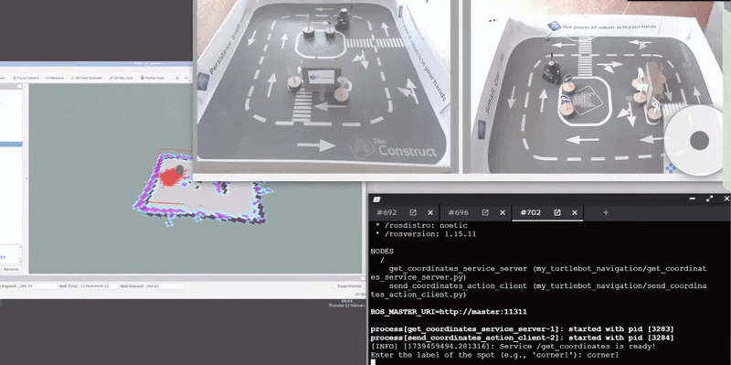

# Autonomous Navigation with ROS and TurtleBot3

**Mobile Robotics · Northeastern University · Jan 2025 – Feb 2025**  
**Stack:** ROS · slam_gmapping · AMCL · move_base · DWA · Gazebo · RViz · TurtleBot3

---

---

## Overview

A complete autonomous navigation pipeline for TurtleBot3 — mapping, localization, path planning, and obstacle avoidance — running in simulation and deployed on real hardware. The project wasn't about reimplementing SLAM or planners from scratch; it was about making the full stack work correctly as an integrated system, which turned out to be a different and equally demanding problem.

---

## System

The pipeline chains four stages: slam_gmapping builds a 2D occupancy grid from LiDAR, the map server saves and serves the static map, AMCL localizes the robot within it using a particle filter, and move_base plans and executes paths to goal poses via a DWA local planner. These nodes communicate through ROS topics, services, and TF frames — when any of them are misconfigured or out of sync, the failures are often silent and hard to trace.

---

## The Hard Part — AMCL and move_base Desynchronization

The most significant issue was a subtle synchronization bug between AMCL and move_base. move_base continuously re-subscribes to the map topic to keep its global and local costmaps current. AMCL, in its default configuration, receives the map only once at startup. This mismatch caused AMCL's particle filter to operate on a stale map reference while move_base was using an updated one — producing costmaps that were misaligned with the robot's actual localization estimate. Navigation looked plausible in RViz but the robot's planned paths were consistently offset from reality.

The fix was modifying AMCL to subscribe to the map topic continuously, matching move_base's behavior. Once both nodes operated on the same map state, localization accuracy and costmap alignment snapped into place. It's the kind of bug that doesn't show up in unit tests or simple simulations — only when the full stack runs together for long enough.

---

## Tuning for Hardware

Simulation success didn't transfer directly to hardware. The physical TurtleBot3 introduced sensor noise, wheel slip, and communication latency that the Gazebo model didn't capture. This required a second round of parameter tuning — tightening AMCL's particle cloud, adjusting costmap inflation radii to account for real sensor noise, and reducing velocity limits to stay within what the hardware controller could reliably track.

Localization loss on the real robot was handled with a rotation-in-place recovery behavior, giving AMCL enough new LiDAR observations to re-converge the particle filter.

---

## What I Learned

Autonomous navigation at the system level is fundamentally an integration problem. Each individual component — SLAM, localization, planning — is well-understood in isolation. Making them work together reliably, with consistent timing and shared state, is where the real difficulty lives. A wrong TF frame, a stale map subscription, or a costmap resolution mismatch can silently break the whole pipeline in ways that take hours to trace.

This experience directly motivated the deeper work in motion planning that followed — understanding where the ROS navigation stack's abstractions break down made me want to work closer to the planning layer itself.
